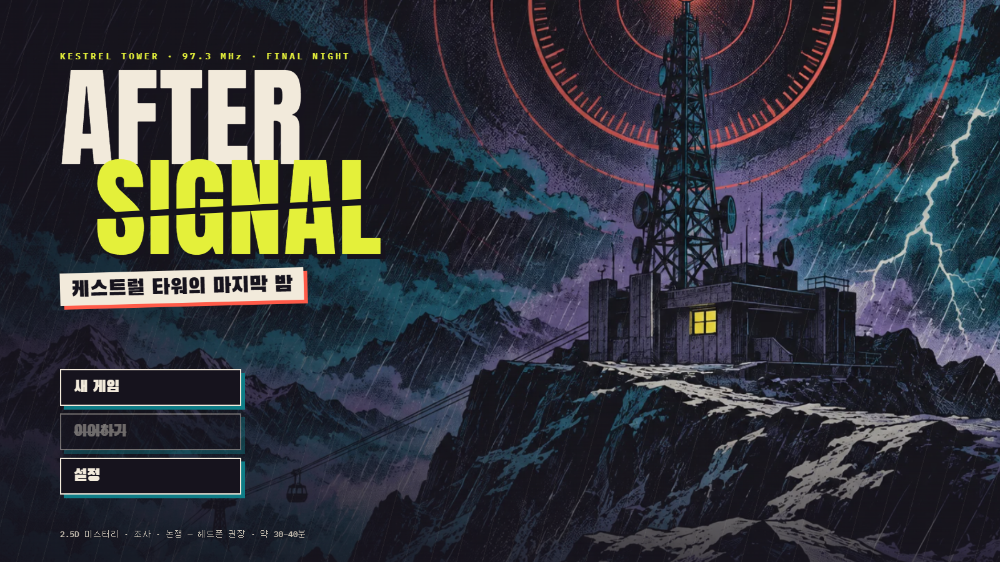
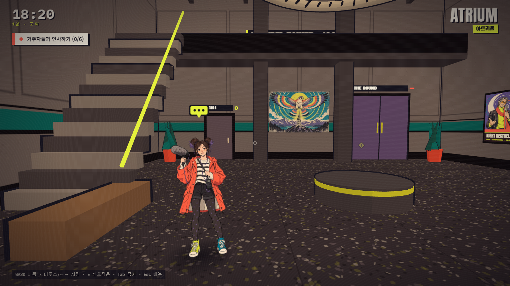
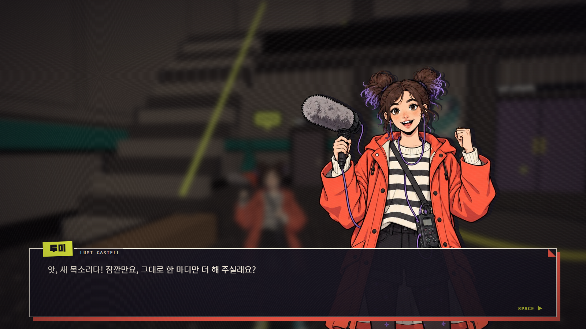
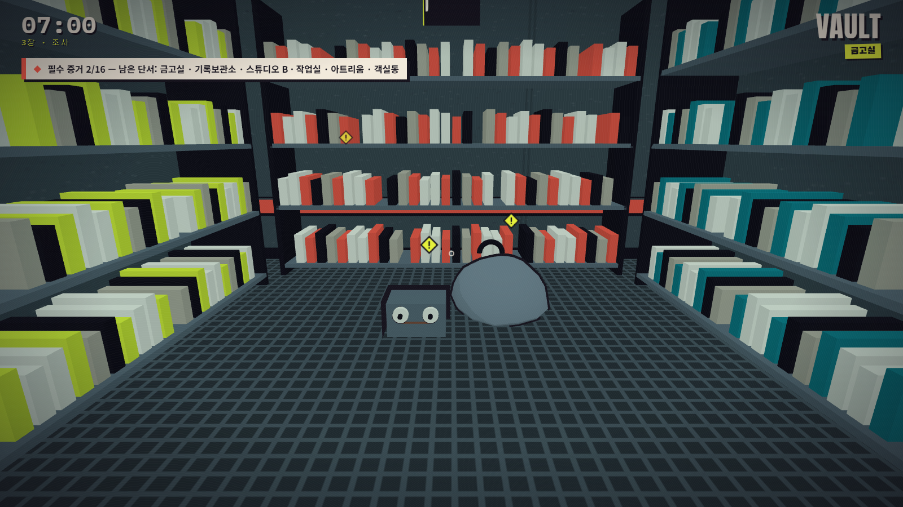
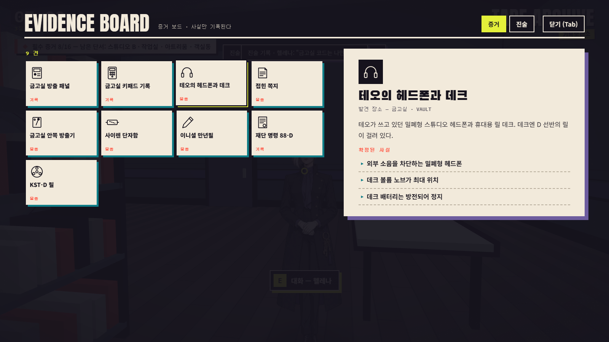
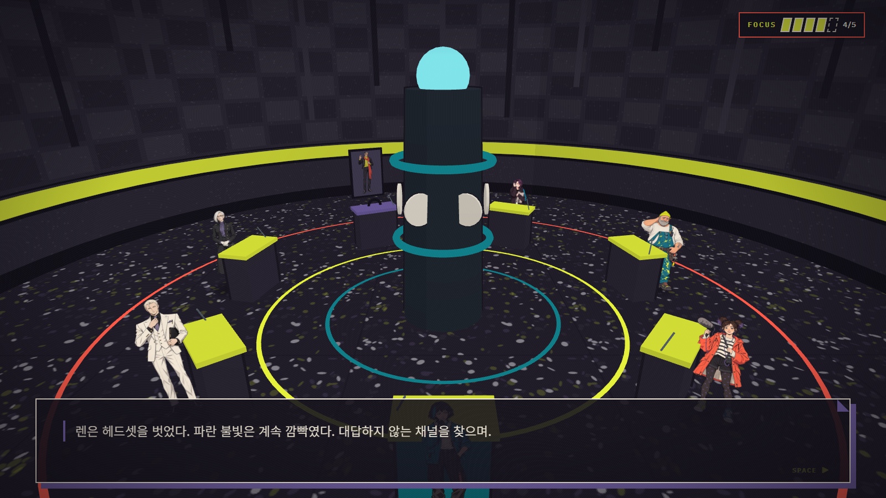
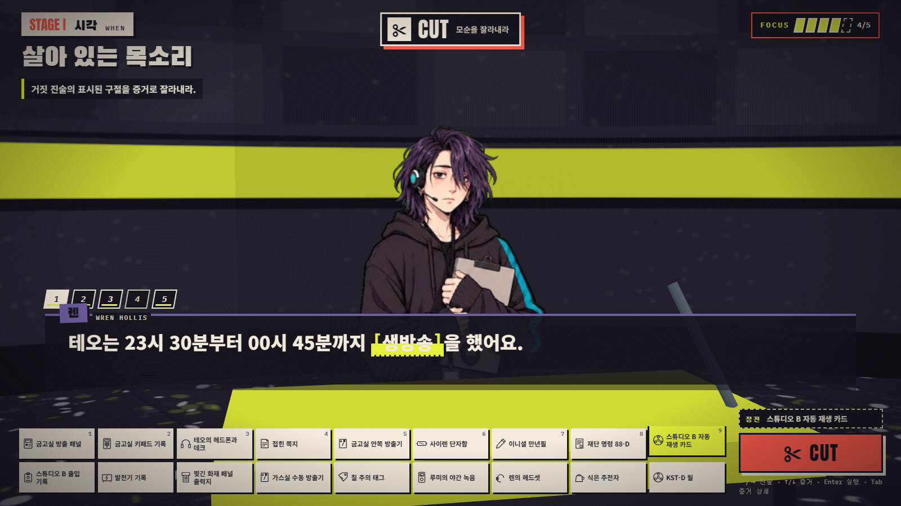
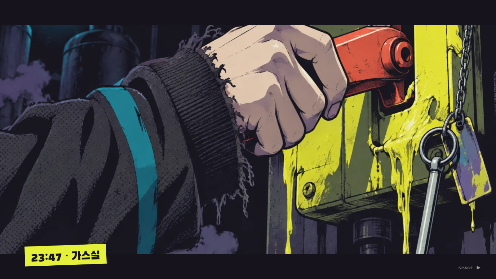
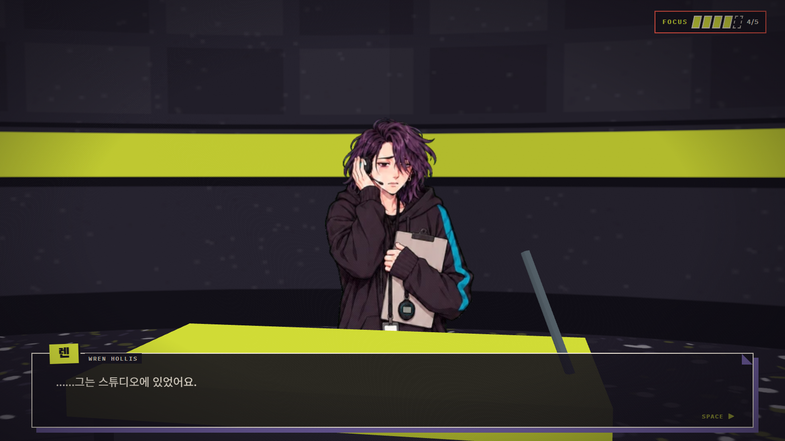
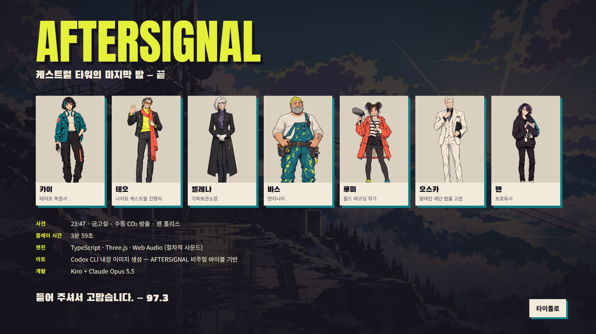

# AFTERSIGNAL — 케스트럴 타워의 마지막 밤

폐쇄 전야의 산정 방송탑에서, 생방송 중이던 진행자가 봉인된 금고실에서 발견된다. 1970년대 보안 체계 WARDEN이 탑을 잠그고 "보고(Account)"를 요구한다. 오디오 복원 기술자 카이가 되어 3D 공간을 걷고, 단서를 모으고, 증언의 모순을 잘라내 진실을 송출하는 **짧고 완결된 2.5D 미스터리 · 조사 · 논쟁 게임**이다 (플레이 약 25–40분).

▶️ [브라우저에서 바로 플레이](https://legerdo.github.io/Deadlock/)



| 탐색 | 대화 | 사건 현장 |
| --- | --- | --- |
|  |  |  |
| **증거 보드** | **크로스와이어 보고 (와이드)** | **CUT 퍼즐** |
|  |  |  |
| **결정적 반전** | **고백** | **엔딩** |
|  |  |  |

## 실행

```bash
npm install
npm run dev        # http://localhost:5317
npm run build      # typecheck + 사건 검증 + vite build → dist/
npm run preview    # http://localhost:4317 (빌드 결과 확인)
```

Node 20.19+ 또는 22.12+ (개발은 Node 24 / npm 11). 브라우저는 WebGL2가 되는 최신 Chromium / Firefox / Safari. `dist/`는 정적 파일이라 어떤 정적 호스팅에도 올릴 수 있다 (`base: './'`).

## 게임 흐름

타이틀 → 프롤로그 → 도착(6명과 인사) → 만찬 → 자유 시간 → 밤(데드 에어) → 사건 발생 → 조사(필수 증거 16개) → 크로스와이어 보고(심의 I–V) → 재구성(VI) → 판결(VII) → 에필로그 → 크레딧

13개의 스토리 상태가 `src/data/story.ts`에 선언되어 있고, 상태 전이는 `StoryMachine` 한 곳에서만 일어난다. 조사는 필수 증거를 모두 모으면 자동으로 끝나며, HUD 목표가 아직 단서가 남은 방을 알려 준다.

### 크로스와이어 보고 (논쟁)

| 동사 | 퍼즐 | 조작 |
| --- | --- | --- |
| **CUT** | 증언의 표시된 구절에 맞는 증거를 골라 모순을 잘라낸다 | 진술 선택 → 증거 장전 → CUT |
| **PATCH** | 흔들리는 *옳은* 진술을 증거로 뒷받침한다 | CUT과 같은 조작, 다른 판정 |
| **TUNE** | 다이얼을 돌려 시각 · 장소 · 인물 등 결정적 선택지를 맞춘다 | ←/→ · Enter |
| **REEL** | 사건 테이프 조각 8개를 시간순으로 이어 붙인다 | 두 조각을 눌러 교환 → SPLICE |

FOCUS 5칸. 틀리면 1칸 감소, 0이 되면 "SIGNAL LOST"로 해당 라운드를 FOCUS 3으로 다시 듣는다 (게임 오버 없음). 반쯤 맞는 답은 벌점 없이 왜 부족한지 설명해 준다. 진행은 라운드마다 저장된다.

## 조작

| 상황 | 키 |
| --- | --- |
| 이동 | WASD (Shift 달리기) |
| 시점 | 화면 클릭 후 마우스, 또는 ←/→ · Q 회전, ↑/↓ 상하 |
| 상호작용 | E (대화 · 조사 · 문) |
| 증거 보드 | Tab |
| 메뉴 | Esc (설정 · 저장하고 타이틀로) |
| 대사 넘기기 | Space / Enter / E / 클릭 |
| 논쟁 | 마우스로 진술 · 증거 · 실행, 또는 ←/→ 진술, ↑/↓ · 1–9 증거, Enter 실행, Tab 증거 상세 |

설정: 텍스트 속도(0 = 즉시), 자동 진행, 마스터/음악/효과음 볼륨, 화면 흔들림, 모션 줄이기, 시점 감도. 설정과 진행은 `localStorage`(`aftersignal.settings.v1`, `aftersignal.save.v1`)에 저장되며, 방 이동 · 단서 획득 · 논쟁 라운드마다 자동 저장된다.

## 기술 구성

- **TypeScript + Vite + Three.js**, UI는 프레임워크 없이 DOM 오버레이.
- **Web Audio 절차적 사운드**: 장면별 잔잔한 건반풍 멜로디와 느린 화음, 캐릭터별 타이핑 음성, 효과음을 모두 코드로 합성 (오디오 파일 없음).
- **폰트**: Anton, Black Han Sans, IBM Plex Mono, Noto Sans KR (`@fontsource`, 번들 포함).

### 2D / 3D 표현

- 방 8개(아트리움, 식당, 스튜디오 B, 기록보관소, 금고실, 작업실, 객실동, 더 라운드)는 `src/data/locations.ts`의 데이터로 `RoomBuilder`가 생성하는 실제 3D 공간이다. 툰 램프 조명, 외곽선, 절차적 바닥/벽 텍스처, 방마다 랜드마크.
- 캐릭터는 Codex로 생성한 전신 일러스트를 **Y축만 회전하는 빌보드**로 세운다. 매니페스트의 bbox로 발끝을 바닥에 맞추고 실제 키(m)로 스케일한다. 카메라 쪽으로만 돌기 때문에 원근 속에서도 종이 인형이 무너지지 않는다.
- 대화는 3D 방을 흐리게 깔고 큰 초상화 + 테이프 라벨 이름표를 올리는 VN 레이어.
- 논쟁은 원형 홀 "더 라운드"에서 7개 연단과 빌보드를 배치하고, `HearingCamera`가 화자 클로즈업(망원) · 투샷 · 와이드 · 궤도 · 푸시인 · 휩 전환을 연출한다.
- 조사 대상은 시선 방향(수평각)으로 고르므로 바닥의 단서도 쉽게 조준된다.

## Codex 이미지 파이프라인

게임에 쓰인 래스터 이미지 38장은 전부 **Codex CLI(`codex exec`)를 비주얼 제작 서브에이전트로 호출**해 만들었다. 읽을 수 있는 글자는 이미지에 넣지 않고 전부 코드로 조판했고, 아이콘은 SVG(`src/ui/icons.ts`)다.

```
art/visual-bible.md, art/character-bible.md   아트 디렉션 · 캐릭터 설정
art/asset-plan.json                           38개 에셋의 용도 · 크기 · 참조 관계
  └─ npm run art:briefs   → art/prompts/<id>.md       에셋별 브리프 (바이블 포함)
  └─ npm run art:gen -- <id|group:kind>                codex exec 실행 (편집은 -i 로 원본 첨부)
        → art/raw/<id>.png                            원본 PNG (로컬 전용, git 제외)
  └─ npm run art:post     → public/assets/generated/  WebP 변환, 512px 보조본, bbox 측정
        → public/assets/generated/manifest.json       출처 · 프롬프트 · 참조 · 크기 기록
```

- 캐릭터 7명의 기준 전신 초상 7장 → 표정 24장은 **기준 초상을 참조 이미지로 첨부한 편집**으로 생성해 얼굴 · 의상 · 비율을 유지했다.
- 키아트 1, 컷인 5, 환경(벽화 · 포스터 · 사진 · 창문 2) 5.
- 한 장(`char_kai_surprised`)은 허리의 번짐 띠 때문에 반려하고, 재시도 노트를 브리프에 추가해 다시 생성했다.
- 요청된 `gpt-image-2.5-sunburst` / `gpt-image-2.5-flare`는 Codex 내장 이미지 도구에서 모델 선택이 노출되지 않아 지정할 수 없었다. 매니페스트에는 "Codex CLI built-in image_gen (image model not exposed)"로 기록되어 있다.

## 프로젝트 구조

```
src/
  data/         스토리 · 방 · 증거 · 대사 · 논쟁 · 사건 진실 그래프 (순수 데이터)
  core/         Game 루프, StoryMachine, 입력, 설정, 저장, 에셋 로더
  world/        RoomBuilder, 절차적 텍스처, Billboard, Player, World
  interaction/  조준 판정
  story/        Director (스크립트 재생)
  ui/           HUD, VN 대화, 오버레이, 증거 보드, 메뉴, 스타일
  trial/        Hearing, HearingCamera, HearingUI, judge
  audio/        절차적 오디오 엔진
  debug/        읽기 전용 디버그 뷰 (E2E · 성능 측정용, 상태 변경 불가)
tools/          validate-case.ts, Codex 파이프라인 스크립트, 후처리
tests/unit/     Vitest
tests/e2e/      Playwright (실제 키보드 · 마우스 입력으로 플레이)
art/            바이블, 에셋 계획, 프롬프트
public/assets/generated/   게임에 쓰이는 WebP + manifest.json
artifacts/screenshots/     E2E가 찍은 검토용 스크린샷 (4개 해상도 포함)
.kiro/specs/game/          요구사항 · 설계 · 작업 목록
```

## 검증

```bash
npm run validate   # 사건 검증기
npm test           # Vitest 단위 테스트
npm run e2e        # Playwright: 빌드 → preview(4317) → 전체 플레이
```

- **사건 검증기** (`tools/validate-case.ts`): 스토리 그래프 도달성, 상태별 방 연결, 필수 증거를 심의 전에 얻을 수 있는지, 각 논쟁 라운드의 정답 증거가 실제로 얻을 수 있는 것인지, REEL 정답의 시간순, 인물 · 시각 TUNE 정답이 진실 그래프와 일치하는지, 인물 동선이 방 이동 시간상 가능한지 등을 확인한다. `npm run build` 전에 항상 실행된다.
- **단위 테스트**: 상태 전이, 스크립트만으로 프롤로그 → 심의 진입까지 재생, 핫스팟이 선언한 증거를 실제로 주는지, 모든 논쟁 라운드의 정답/부분 정답/오답 판정, 저장 · 설정 직렬화와 손상 데이터 처리, 조준 판정.
- **E2E**: `playthrough.spec.ts`는 새 게임부터 크레딧까지 실제 입력만으로 플레이한다 (디버그 뷰는 위치 · 주변 오브젝트 · 이동 가능 영역을 *읽기*만 하고, 이동은 WASD/방향키로 한다). 도중에 새로고침 후 "이어하기"를 검증하고, 일부러 한 번 틀려 FOCUS 감소를 확인한다. `hearing.spec.ts`는 심의 직전 저장에서 이어 크레딧까지 간다. 두 스펙 모두 페이지 오류 · 콘솔 오류 · 요청 실패 · HTTP ≥ 400 · WebGL 경고가 하나라도 있으면 실패하고, 1280×720 · 1366×768 · 1600×900 · 1920×1080에서 UI가 화면을 벗어나거나 글자가 넘치는지 검사한다.


## 변경 기록

### 2026-09-30 · 배경음 개선

- 저음 드론, 빗소리·테이프 히스, 반복 타격음 중심의 배경음을 잔잔한 건반풍 멜로디와 느린 화음 진행으로 교체했다.
- 평온·밤·긴장·심의·새벽의 다섯 분위기에 각각 화음과 템포를 적용하고, 음 사이에 여백을 두었다.
- 음악 출력 배율을 0.55에서 0.4로 낮추고 장면 전환 시 페이드를 적용했다. 기존 사용자 볼륨 설정, 효과음, 저장 형식은 유지한다.
- 검증: 프로덕션 빌드(타입 검사·사건 검증 포함) 통과. 실제 Chromium에서 음악 재생·설정 슬라이더의 음소거/복원·새 게임 진입을 확인했다. 별도 Web Audio 통합 확인에서 다섯 분위기의 출력과 빠른 전환 후 정지 시 무음을 확인했다. 전체 플레이 E2E는 이번 변경에서 재실행하지 않았다.

## GitHub Pages 업데이트

공개 페이지는 `main` 브랜치의 `docs/`를 배포한다. `npm run build` 성공 후 `dist/` 내용을 `docs/`에 복사하고 빈 `docs/.nojekyll` 파일을 유지한 다음, 소스·문서·배포 파일을 함께 커밋하고 푸시한다. 소스만 푸시하면 공개 게임은 갱신되지 않는다. 배포 완료 후 공개 HTML이 새 JavaScript 파일을 참조하는지와 HTML/JS/CSS 응답을 확인한다.
